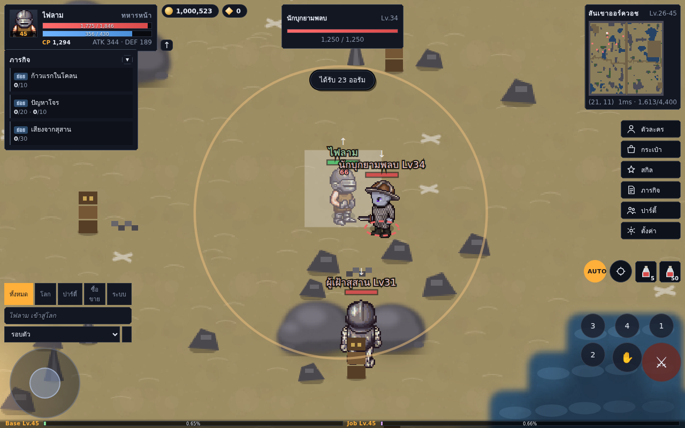
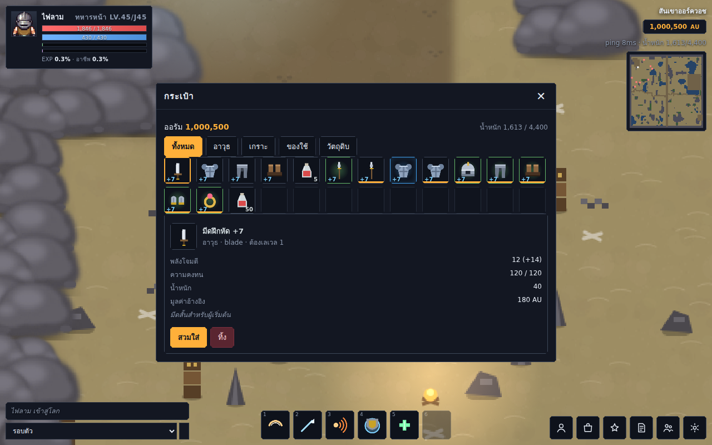
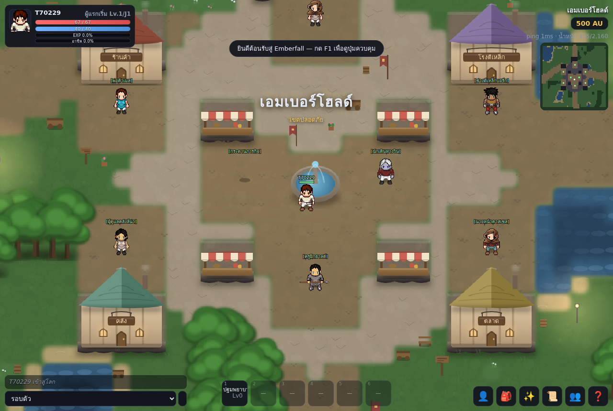
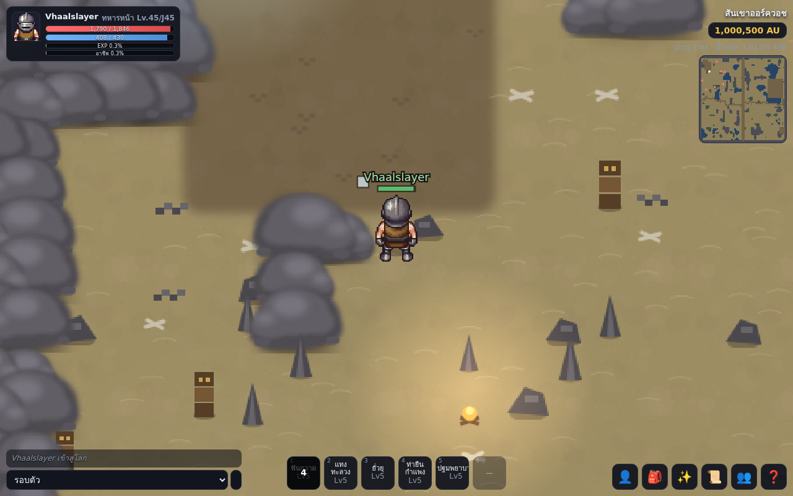
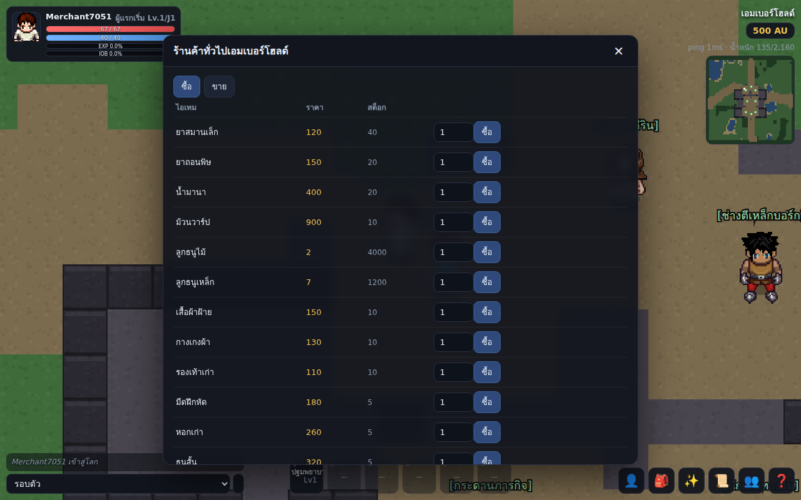

# Emberfall Online

เกม **2D MMORPG** เล่นผ่านเบราว์เซอร์ (และมือถือในอนาคต) แนวเดียวกับ Ragnarok
แต่เป็นโลก ระบบ และตัวเลขของเราเอง — **บังคับด้วยจอยเกมเป็นหลัก** รองรับทัชสกรีนและคีย์บอร์ดด้วย

งานศิลป์ทั้งหมดดึงจาก [Universal LPC Spritesheet](https://github.com/makrohn/Universal-LPC-spritesheet)
(ดูเครดิตและสัญญาอนุญาตที่ `assets/lpc/CREDITS.md`)

```
npm install
npm start           # http://localhost:8080
```

ต้องการดึงงานศิลป์ใหม่จากต้นทาง:

```
git clone --depth 1 https://github.com/makrohn/Universal-LPC-spritesheet.git
npm run import-lpc -- ./Universal-LPC-spritesheet
```







## เดโมเล่นในเบราว์เซอร์ (ไม่ต้องมีเซิร์ฟเวอร์)

```
node tools/build-demo.js        # -> dist/demo
npx serve dist/demo             # หรือ static server ตัวไหนก็ได้
```

สคริปต์จะรวมไคลเอนต์ ข้อมูลเกม และ **เซิร์ฟเวอร์ตัวจริง** ไว้ในโฟลเดอร์เดียว
แล้วใส่ import map สลับสามโมดูลเป็นตัวแทนฝั่งเบราว์เซอร์ (`demo/`):

| โมดูลจริง | ตัวแทนในเดโม |
|---|---|
| `client/js/net.js` (WebSocket) | loopback เรียก `Conn` ในหน้าเดียวกัน |
| `server/persistence.js` (ไฟล์ JSON) | `localStorage` |
| `node:crypto` | ไดเจสต์สั้นๆ (รหัสผ่านไม่ออกจากเครื่อง) |

ผลคือหน้าเว็บหน้าเดียวที่รันโลกทั้งใบในเบราว์เซอร์ — เล่นคนเดียว ไม่มีผู้เล่นอื่น
แต่เป็นโค้ดชุดเดียวกับเซิร์ฟเวอร์จริงทุกบรรทัด เหมาะกับการลองเล่นและส่งให้คนอื่นเทส

## ปรัชญาการออกแบบ

| หัวข้อ | ทางเลือกของเรา |
|---|---|
| การเล่น | เหมือน MMORPG คลาสสิก: ตี-เก็บเลเวล-แบ่งแต้ม-ตีบวก-ตั้งปาร์ตี้-ซื้อขาย |
| หน้าตา | ไม่ลอก Ragnarok — ชื่อ อาชีพ มอนสเตอร์ แผนที่ ทั้งหมดเป็นของเราเอง |
| เศรษฐกิจ | **เงินหายากโดยตั้งใจ** ของถึงมีค่า (ดู `docs/ECONOMY.md`) |
| การบังคับ | ออกแบบจากจอยก่อน แล้วแมปลงทัช/คีย์บอร์ด (ดู `docs/CONTROLS.md`) |
| เซิร์ฟเวอร์ | authoritative ทั้งหมด ไคลเอนต์ทำแค่ทำนายการเดินของตัวเอง |

## โครงสร้าง

```
shared/          โค้ดและฐานข้อมูลที่ทั้งสองฝั่งใช้ร่วมกัน
  constants.js   ค่าคงที่ + opcode ของโปรโตคอล
  formulas.js    สูตรสเตตัส/ดาเมจ/ราคา (pure functions)
  data/          jobs, skills, items, monsters, maps, npcs, quests
server/
  index.js       static server + websocket
  net.js         โปรโตคอลต่อหนึ่งการเชื่อมต่อ
  accounts.js    สมัคร/ล็อกอิน/สร้างตัวละคร (scrypt)
  persistence.js เก็บสถานะลง JSON แบบ atomic
  game/          world, zone, player, monster, combat, skills, economy, party, quests
client/
  index.html     โครง HUD ทั้งหมด
  js/            main, net, input (จอย/ทัช/คีย์), renderer, sprites, ui
assets/lpc/      สไปรต์ LPC ที่คัดมา 118 แผ่น + ไฟล์สัญญาอนุญาต
tools/           สคริปต์ดึงงานศิลป์จากต้นทาง
docs/            เอกสารออกแบบเกม เศรษฐกิจ ปุ่มควบคุม และแผนพัฒนา
```

## สถานะตอนนี้

7 โซน · มอนสเตอร์ 19 ชนิด (รวมบอส 2) · NPC 8 ตัวในเมืองที่มีอาคารจริง

เล่นได้จริงตั้งแต่ต้นจนจบลูป: สมัคร → สร้างตัวละคร → เดิน → ตี → เก็บของ →
เลเวลอัพ → แบ่งแต้ม → เรียนสกิล → เปลี่ยนอาชีพ → ซื้อขาย/ตีบวก/ฝากของ →
ลงตลาดผู้เล่น → ตั้งปาร์ตี้ → ทำเควสต์ → ล่าบอส

สำหรับทดสอบเนื้อหาเลเวลสูง เปิดโหมดพัฒนา:

```
EMBERFALL_DEV=1 npm start
```

แล้วในคอนโซลเบราว์เซอร์: `__game.net.send({t:'devWarp', map:'frostvault'})`
หรือ `__game.net.send({t:'devBoost', level:70, job:'vanguard'})`
(ปิดสนิทเมื่อไม่ได้ตั้ง `EMBERFALL_DEV=1`)

ดูงานที่เหลือและลำดับความสำคัญได้ที่ `docs/ROADMAP.md`

## ใบอนุญาต

โค้ด: GPL-3.0-or-later (ให้เข้ากับงานศิลป์ LPC ที่เป็น CC-BY-SA 3.0 / GPL 3.0)
