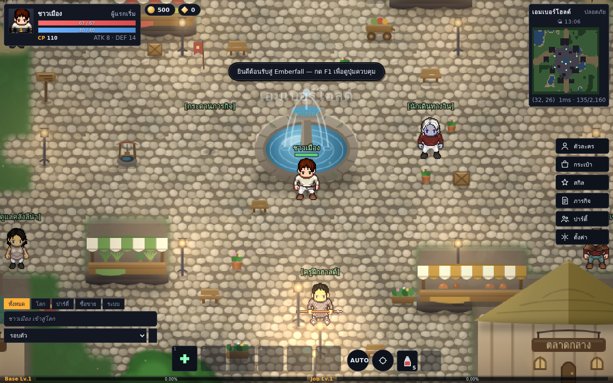
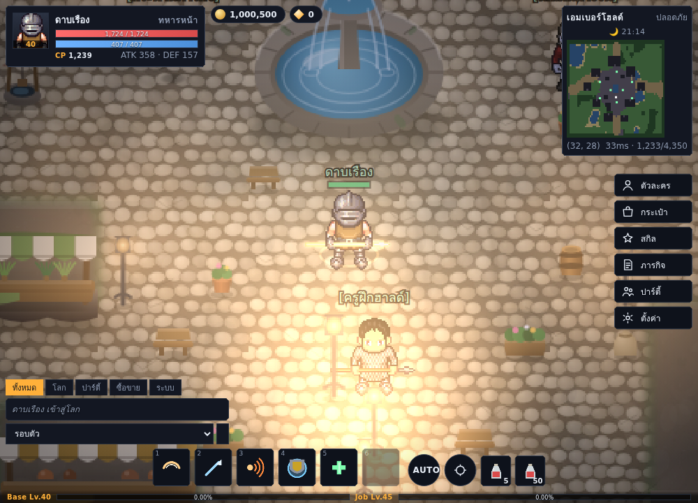
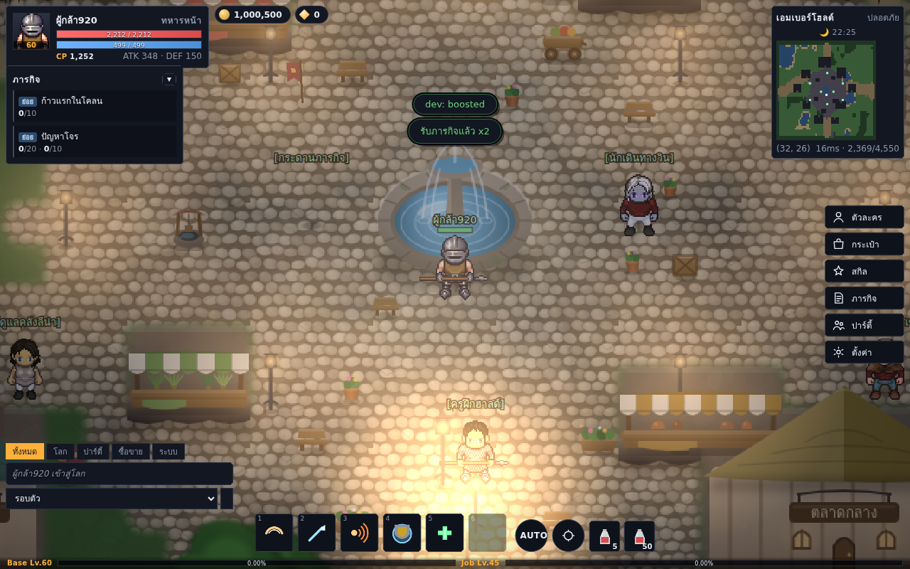
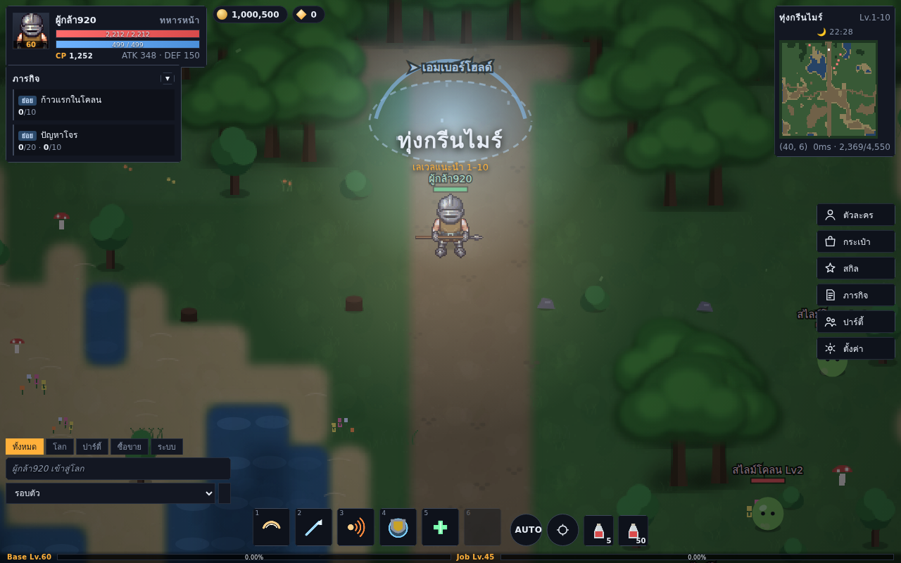

# Artaria Frontier Online (AFO)

อาร์ทาเรีย ฟรอนเทียร์ ออนไลน์

เกม **2D MMORPG** เล่นผ่านเบราว์เซอร์ (และมือถือในอนาคต) แนวเดียวกับ Ragnarok
แต่เป็นโลก ระบบ และตัวเลขของเราเอง — **บังคับด้วยจอยเกมเป็นหลัก** รองรับทัชสกรีนและคีย์บอร์ดด้วย

งานศิลป์ทั้งหมดดึงจาก [Universal LPC Spritesheet](https://github.com/makrohn/Universal-LPC-spritesheet)
(ดูเครดิตและสัญญาอนุญาตที่ `assets/lpc/CREDITS.md`)

```
npm install
npm start           # http://localhost:8080
```

ต้องการดึงงานศิลป์ใหม่จากต้นทาง:

```
git clone --depth 1 https://github.com/makrohn/Universal-LPC-spritesheet.git
npm run import-lpc -- ./Universal-LPC-spritesheet
```








## ทดสอบ

```
npm test          # ตรรกะทั้งหมด 148 เคส จบใน 12 วินาที ไม่ต้องติดตั้งอะไรเพิ่ม
npm run test:e2e  # เล่นจริงในเบราว์เซอร์ (ต้อง npm i ก่อน)
npm run test:all  # ทั้งสองชุด
npm run balance   # รายงานสมดุล: เวลาตีมอน ความคุ้มในแต่ละโซน เวลา 1→70 เงินต่อชั่วโมง
```

`npm test` ใช้ตัวรัน `node --test` ที่มากับ Node 22 จึงรันได้ทันทีบนเครื่องเปล่า
ครอบคลุมสูตรคำนวณ, ความถูกต้องของข้อมูลทุกไฟล์ (ทุกการอ้างอิงและทุกไฟล์สไปรต์),
ความเชื่อมต่อของทุกแผนที่, pathfinding, ประตูปาร์ตี้, ล็อกรางวัลรายสัปดาห์,
สคริปต์บอสทุกเฟส, aggro ตามช่องว่างเลเวล, เศรษฐกิจ, สมดุลเควสต์ และสมดุลการเล่น

`npm run balance` อ่านตัวเลขทั้งหมดใน `shared/data` แล้วบอกสิ่งที่การอ่าน diff ไม่เห็น:
กี่วินาทีต่อมอนหนึ่งตัว, มอนตัวไหนในโซนที่ไม่มีเหตุผลจะตี, และกี่ชั่วโมงจากเลเวล 1
ถึงแคป และเงินสุทธิต่อชั่วโมงหลังหักค่ายา เกณฑ์ทุกตัวถูกยืนยันซ้ำใน
`test/balance.test.js` ด้วย คอมมิตที่แก้แต่ HP มอนตัวเดียวจนทำเลเวลช่วงนั้นกลายเป็น
กำแพง หรือตั้งมูลค่าของชิ้นเดียวจนขาย NPC กลายเป็นเครื่องปั๊มเงิน จะทำให้ CI ตก
ไม่ใช่รอให้คนเล่นมาเจอเอง

ดูแยกส่วนได้: `npm run balance -- kills | zones | curve | money | jobs`

```
npm run load      # ความจุเซิร์ฟเวอร์: 150 ไคลเอนต์ 30 วินาที
npm run soak      # ปล่อยบอทเล่นต่อเนื่อง ดู heap / entity / การเซฟลงดิสก์
npm run sheet -- art.png   # บอกว่าชีตนี้กริดเท่าไร และต้องประกาศ layout ยังไง
```

`npm run load` เปิดเซิร์ฟเวอร์จริงบนฐานข้อมูลชั่วคราว แล้วต่อซ็อกเก็ตดิบเข้าไป
(ไม่ใช่เบราว์เซอร์ — สิ่งที่วัดคือเซิร์ฟเวอร์ ไม่ใช่ว่าเปิด Chromium ได้กี่ตัว)
ทุกตัวเดินไปมาเพื่อให้ระบบ AOI ทำงานจริง แล้วรายงานสแนปช็อตต่อวินาที ช่องว่างยาวสุด
และแบนด์วิดท์ต่อคน — ตัวสุดท้ายคือตัวที่กำหนดเพดานจริงของเซิร์ฟเวอร์นี้

โมเดลของมันเล่นแบบคนเล่นจริง: เลือกอาชีพตามเลเวล ลงสเตตัสตามสายนั้น ใส่ของที่ดีที่สุด
ที่เลเวลนั้นใส่ได้ สลับอาวุธตามธาตุของมอน แล้ว**จำลองรอบสกิลจริงทั้งคูลดาวน์ SP และ
คาสต์ไทม์** ตัวเลขทุกตัวเป็นค่ากลางของทุกอาชีพในเลเวลนั้น ไม่ใช่สายที่เก่งที่สุด

`npm run test:e2e` เปิดเซิร์ฟเวอร์จริงบนฐานข้อมูลชั่วคราว แล้ว:

* **เล่นผ่าน Chromium** — สมัคร สร้างตัวละคร เข้าโลก เปิดทุกหน้าต่าง สู้จริง
  และตรวจว่าเลย์เอาต์มือถือไม่มี HUD ทับกัน (ข้ามถ้าไม่มี Playwright)
* **ฆ่าเซิร์ฟเวอร์แล้วเปิดใหม่** เพื่อพิสูจน์ว่ากิลด์กับปาร์ตี้รอด
* **ยิงช่องโหว่ใส่เซิร์ฟเวอร์ด้วย raw socket** — จำนวนติดลบ index นอกขอบ
  คำสั่ง dev ตอนปิด dev speed hack เทรดกับตัวเอง ลงตลาดราคาติดลบ
  และตรวจว่าไม่มีอันไหนทำให้ออรัมเพิ่มขึ้นแม้แต่บาทเดียว

## เอาขึ้นเซิร์ฟเวอร์จริง

```
docker compose up -d --build     # เปิด http://localhost:8080
```

ตัวแปรที่ตั้งได้:

| ตัวแปร | ค่าเริ่มต้น | ทำอะไร |
|---|---|---|
| `AFO_ADMIN_TOKEN` | *(ปิด)* | เปิดแดชบอร์ดเศรษฐกิจที่ `/admin?token=...` |
| `AFO_MAX_ACCOUNTS_PER_IP` | `5` | จำกัดการสมัครต่อ IP ต่อวัน · `0` = ไม่จำกัด (เกม LAN) |
| `AFO_STORE` | `sqlite` | `sqlite` หรือ `json` |
| `AFO_DATA` | `./data` | ที่เก็บฐานข้อมูล |
| `AFO_DEV` | *(ปิด)* | เปิดคำสั่ง `devWarp` / `devBoost` / `devRefine` |

process เดียวจบ: เสิร์ฟไฟล์ไคลเอนต์และรับ WebSocket บนพอร์ตเดียวกัน ไม่มีขั้นตอน
build ข้อมูลโลกอยู่ใน SQLite ไฟล์เดียวที่ `/data` (ผูก volume ไว้แล้ว)
รายละเอียด reverse proxy, HTTPS, systemd, สำรองข้อมูล ดู `docs/DEPLOY.md`

## เดโมเล่นในเบราว์เซอร์ (ไม่ต้องมีเซิร์ฟเวอร์)

```
node tools/build-demo.js        # -> dist/demo
npx serve dist/demo             # หรือ static server ตัวไหนก็ได้
```

สคริปต์จะรวมไคลเอนต์ ข้อมูลเกม และ **เซิร์ฟเวอร์ตัวจริง** ไว้ในโฟลเดอร์เดียว
แล้วใส่ import map สลับสามโมดูลเป็นตัวแทนฝั่งเบราว์เซอร์ (`demo/`):

| โมดูลจริง | ตัวแทนในเดโม |
|---|---|
| `client/js/net.js` (WebSocket) | loopback เรียก `Conn` ในหน้าเดียวกัน |
| `server/persistence.js` (ไฟล์ JSON) | `localStorage` |
| `node:crypto` | ไดเจสต์สั้นๆ (รหัสผ่านไม่ออกจากเครื่อง) |

ผลคือหน้าเว็บหน้าเดียวที่รันโลกทั้งใบในเบราว์เซอร์ — เล่นคนเดียว ไม่มีผู้เล่นอื่น
แต่เป็นโค้ดชุดเดียวกับเซิร์ฟเวอร์จริงทุกบรรทัด เหมาะกับการลองเล่นและส่งให้คนอื่นเทส

## ภาพและบรรยากาศ

ทุกอย่างวาดด้วยโค้ด ไม่มีไฟล์ภาพเพิ่มนอกจากสไปรต์ LPC:

* **วงจรกลางวัน-กลางคืน** หนึ่งวันในเกม = 24 นาทีจริง คำนวณจากนาฬิกาจริง
  ผู้เล่นทุกคนจึงเห็นเวลาเดียวกันโดยไม่ต้องให้เซิร์ฟเวอร์ส่งอะไรเลย
  ฟ้าไล่สีจากรุ่งสาง → กลางวัน → ทองอัสดง → กลางคืน คบไฟและโคมสว่างขึ้นตามเวลา
  และเราจะมีแสงติดตัวเองเมื่อมืดพอ (ในถ้ำ/สุสานสว่างตลอด เพราะไม่มีท้องฟ้า)
* **อนุภาคประจำโซน** — ละอองฝุ่นในเมือง ใบไม้ปลิวในทุ่ง หิ่งห้อยในบึง
  ฝุ่นวิญญาณในสุสาน ทรายในภูเขาหิน หิมะโปรยในถ้ำน้ำแข็ง
* **ฝุ่นฟุ้งตอนเดิน ประกายตอนฟันโดน** และควันจางตอนล้ม
* **ต้นหญ้า ดอกไม้ กอกก โยกตามลม** ด้วยการเอียงภาพจากโคนต้น
* เงาใต้ตัวละครนุ่มและปรับขนาดตามสไปรต์ + vignette บางๆ ให้สายตาอยู่กลางจอ
* **เมืองปูด้วยหินจริง** ก้อนหินเรียงแบบก่ออิฐ มีร่องปูน คราบเปียก และรอยทางเดิน
  แผ่ออกจากน้ำพุกลางลาน ร้านแผงลอยมีผ้าใบคนละสีและขายคนละอย่าง
* **อาวุธที่ตีบวกจะเปล่งแสง** ตั้งแต่ +3 ขึ้นไป ไล่ระดับที่ +3 / +5 / +7 / +8 / +10 / +12
  แสงเกาะไปตามเฟรมการฟันจริงๆ ระดับสูงจะสาดแสงลงพื้นและมีประกายปลิวออกจากคมดาบ

## ปรัชญาการออกแบบ

| หัวข้อ | ทางเลือกของเรา |
|---|---|
| การเล่น | เหมือน MMORPG คลาสสิก: ตี-เก็บเลเวล-แบ่งแต้ม-ตีบวก-ตั้งปาร์ตี้-ซื้อขาย |
| หน้าตา | ไม่ลอก Ragnarok — ชื่อ อาชีพ มอนสเตอร์ แผนที่ ทั้งหมดเป็นของเราเอง |
| เศรษฐกิจ | **เงินหายากโดยตั้งใจ** ของถึงมีค่า (ดู `docs/ECONOMY.md`) |
| การบังคับ | ออกแบบจากจอยก่อน แล้วแมปลงทัช/คีย์บอร์ด (ดู `docs/CONTROLS.md`) |
| การติดตั้ง | คอนเทนเนอร์เดียว ไม่มี build step, dependency ตัวเดียวคือ `ws` (ดู `docs/DEPLOY.md`) |
| เซิร์ฟเวอร์ | authoritative ทั้งหมด ไคลเอนต์ทำแค่ทำนายการเดินของตัวเอง |

## โครงสร้าง

```
shared/          โค้ดและฐานข้อมูลที่ทั้งสองฝั่งใช้ร่วมกัน
  constants.js   ค่าคงที่ + opcode ของโปรโตคอล
  formulas.js    สูตรสเตตัส/ดาเมจ/ราคา (pure functions)
  data/          jobs, skills, items, monsters, maps, npcs, quests
server/
  index.js       static server + websocket
  net.js         โปรโตคอลต่อหนึ่งการเชื่อมต่อ
  accounts.js    สมัคร/ล็อกอิน/สร้างตัวละคร (scrypt)
  persistence.js เก็บสถานะลง SQLite (หรือ JSON) สลับได้ด้วย AFO_STORE
  store-sqlite.js แบ็กเอนด์ SQLite ที่ใช้ node:sqlite ในตัว Node
  admin.js       แดชบอร์ดเศรษฐกิจที่ /admin (ปิดไว้จนกว่าจะตั้ง token)
  game/          world, zone, player, monster, combat, skills, economy,
                 party, guild, quests, boss, trade
client/
  index.html     โครง HUD ทั้งหมด
  js/            main, net, input (จอย/ทัช/คีย์), renderer, sprites, ui
assets/lpc/      สไปรต์ LPC ที่คัดมา 118 แผ่น + ไฟล์สัญญาอนุญาต
test/            ชุดทดสอบ (node:test, ไม่ต้องติดตั้งอะไรเพิ่ม)
  e2e/           ทดสอบผ่านเบราว์เซอร์จริงด้วย Playwright (ข้ามอัตโนมัติถ้าไม่มี)
tools/           สคริปต์ดึงงานศิลป์จากต้นทาง
docs/            เอกสารออกแบบเกม เศรษฐกิจ ปุ่มควบคุม และแผนพัฒนา
```

## สถานะตอนนี้

7 โซน · มอนสเตอร์ 19 ชนิด (รวมบอส 2) · NPC 8 ตัวในเมืองที่มีอาคารจริง

เล่นได้จริงตั้งแต่ต้นจนจบลูป: สมัคร → สร้างตัวละคร → เดิน → ตี → เก็บของ →
เลเวลอัพ → แบ่งแต้ม → เรียนสกิล → เปลี่ยนอาชีพ → ซื้อขาย/ตีบวก/ฝากของ →
ลงตลาดผู้เล่น → เทรดตัวต่อตัว → ตั้งปาร์ตี้ → ทำเควสต์ → ล่าบอส

สำหรับทดสอบเนื้อหาเลเวลสูง เปิดโหมดพัฒนา:

```
AFO_DEV=1 npm start
```

แล้วในคอนโซลเบราว์เซอร์: `__game.net.send({t:'devWarp', map:'frostvault'})`
หรือ `__game.net.send({t:'devBoost', level:70, job:'vanguard'})`
(ปิดสนิทเมื่อไม่ได้ตั้ง `AFO_DEV=1`)

ดูงานที่เหลือและลำดับความสำคัญได้ที่ `docs/ROADMAP.md`

## ใบอนุญาต

โค้ด: GPL-3.0-or-later (ให้เข้ากับงานศิลป์ LPC ที่เป็น CC-BY-SA 3.0 / GPL 3.0)
